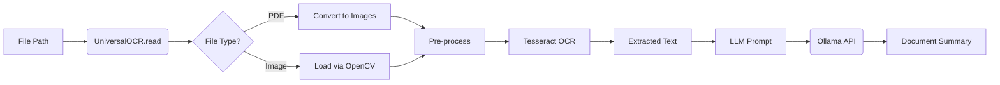
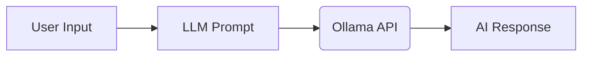

# OCR Engine & AI Analyzer

A powerful document processing engine that combines Tesseract OCR with local LLM capabilities (via Ollama) to extract, summarize, and interact with text from images and PDFs.

##  Features

- **Universal OCR**: Support for both images (PNG, JPG, etc.) and PDF documents.
- **Pre-processing**: Automatic image cleaning (grayscale, thresholding) for better OCR accuracy.
- **AI Analysis**: Integration with local LLMs (like Gemma, Llama) for document summarization.
- **Interactive Chat**: Built-in chat mode to interact with the AI model.
- **Dependency-Lite PDF**: Uses `PyMuPDF` (fitz) for PDF-to-image conversion, avoiding complex system dependencies like Poppler.

---

##  Architecture

The project is split into two main components:
1.  **`ocr.py`**: The core engine handling text extraction and image processing.
2.  **`sample.py`**: The application layer handling the CLI, LLM orchestration, and user interaction.

### 1. `UniversalOCR` Class (`ocr.py`)

The primary class for all OCR operations.

| Method | Description |
| :--- | :--- |
| `__init__(tesseract_cmd, lang)` | Initializes the engine. Can optionally set the path to the Tesseract executable. |
| `read(file_path)` | The main entry point. Automatically detects file type (PDF vs Image) and calls the appropriate handler. |
| `read_image(image_path)` | Processes a single image file using OpenCV and Pytesseract. |
| `read_pdf(pdf_path)` | Converts PDF pages to images in-memory using `PyMuPDF` and processes each page. |
| `_preprocess(img)` | Internal helper that applies grayscale conversion and binary thresholding to improve character recognition. |

### 2. Application Functions (`sample.py`)

| Function | Description |
| :--- | :--- |
| `ask_llm(prompt)` | Sends a POST request to the local Ollama API (`/api/generate`) and returns the text response. |
| `process_file(path)` | Orchestrates the full pipeline: Reads file -> Extracts text -> Sends to LLM for summarization -> Prints results. |
| `chat()` | Enters a loop for direct conversation with the configured LLM. |

---

##  Pipelines

### A. Document Analysis Pipeline
This pipeline is triggered when selecting Option 1 in the menu.



### B. Chat Pipeline
This pipeline is triggered when selecting Option 2 in the menu.



---

##  Prerequisites

1.  **Tesseract OCR**: Install Tesseract on your system.
    - [Download for Windows](https://github.com/UB-Mannheim/tesseract/wiki)
2.  **Ollama**: Install and run Ollama locally.
    - [Ollama Website](https://ollama.com/)
    - Pull the required model: `ollama pull gemma4:e2b` (or your preferred model)
3.  **Python Environment**:
    It is recommended to use a virtual environment.
    ```bash
    # Create environment
    python -m venv ocrengine

    # Activate (Windows)
    ocrengine\Scripts\activate

    # Activate (Linux/macOS)
    source ocrengine/bin/activate

    # Install dependencies
    pip install pytesseract opencv-python pymupdf numpy requests
    ```

##  Configuration

In `sample.py`, ensure the following paths match your system:
- `tesseract_cmd`: Path to `tesseract.exe`.
- `OLLAMA_URL`: URL of your local Ollama instance (default `http://localhost:11434/api/generate`).
- `MODEL`: The name of the model you want to use (e.g., `gemma:2b`).

---

##  Usage

Run the main application:
```bash
python sample.py
```
